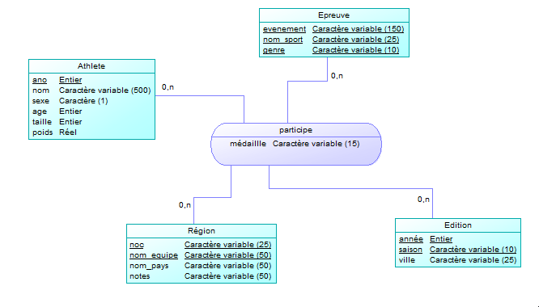

# s2.04 - Exploitation de BDD


## Introduction

*Lien du repos git: [s2.04](https://github.com/brvslow/s2.04)*

*Pour éxécuter correctement le fichier sql '[importation.sql](./sql/importation.sql)', veuillez éxecuter la commande depuis la racine du projet soit:*

```
but1=> \i sql/importation.sql
```

**Compilation du Markdown**

*Il faut un moteur PDF permetant de générer le pdf au préalable, tel que **pdflatex**.*

Le fichier 'metadata.yml' inclut les données au-delà du fichier Markdown:

- Le titre du document
- Les noms des auteurs
- Et plusieurs variables LaTeX pour configurer la page d'en-tête

```
pandoc --toc --template=template/eisvogel.tex metadata.yml README.md -o README.pdf
```

## Exercice 1 : Comprendre les données

Pour commencer, nous allons analyser les données de ces fichiers CSV, il faut comprendre ces données avant d'entreprendre toute action au niveau du SGBD.

Tout d'abord on compte le nombre de lignes de ces fichiers CSV

```
cat <nom_fichier> | wc -l
```
Soit:

- **athlete_events.csv** : (271176 lignes)

```
cat csv/athlete_events.csv | wc -l
```

- **noc_regions.csv** : (230 lignes)

```
cat csv/noc_regions.csv | wc -l
```

Il est aussi primordial de connaître la nature des valeurs de chaque ligne du fichier CSV, pour cela on regarde la première ligne de ce fichier car au format CSV, elle indique les colonnes.

```
cat csv/athlete_events.csv | head -n 1
```

Le format CSV (ou Comma-Separated Values) utilise comme son nom l'indique les virgules pour séparer les valeurs de chaque colonne, c'est ainsi que le fichier CSV est codé, cela nous sera important pour la suite des opérations.

On peut compter ce nombre de colonnes pour chaque fichier CSV:

- **athlete_events.csv** : (15 colonnes)

```
cat csv/athlete_events.csv | head -n 1 | tr ',' '\n' | wc -l
```

- **noc_regions.csv** : (3 colonnes)
```
cat csv/noc_regions.csv | tr "\r\n" "\n" | head -n 1 | tr "," "\n" | wc -l
```

Par exemple, nous pouvons remarquer une colonne 'Season' dans le fichier 'athlete_events.csv', qui stocke la saison d'une édition des JO pour chaque ligne.

Pour vérifier les données, nous pouvons vérifier l'existence de certains athlètes dans ce fichier CSV via cette commande:

- **athlete_events.csv** : (6 lignes)
```
cat csv/athlete_events.csv | grep "Jean-Claude Killy" | wc -l
```

Nous avons donc un fichier CSV opérationnel.

Enfin, dernière chose à vérifier est évidemment l'encodage, il faut vérifier s'il est encodé autrement qu'en ASCII, pour le gérer par la suite. Ici, c'est ASCII donc on ne fera rien de spécial au niveau de l'encodage.

- **athlete_events.csv** : (us-ascii)
```
file --mime-encoding csv/athlete_events.csv
```

Désormais, on envisage d’importer les données en créeant une table dans le base PostgreSQL et en utilisant la commande ``\copy`` pour copier les données du CSV dans cette table.

## Exercice 2 : Importer les données

*cf: [sql/importation.sql](./sql/importation.sql), des commentaires ont été fournis pour étoffer nos explications...*

### Création et remplissage de la table import_athetes

Désormais, nous allons passer aux choses concrètes, en important les données dans le SGBD PostgreSQL...

Premièrement, nous allons stocker toutes les données sur une seule table qu'on va appeller 'import_athletes', nous avons géré le type de chaque colonne de cette table pour avoir les types de valeurs les plus précis et convenables possible selon la colonne. (ex: numeric(5,2) car le poids se situe entre 0 et 100kg doinc 3 chiffres et on considère 2 chiffres après la virgule)

```sql
CREATE TABLE import_athletes(
    id int,
    name varchar(500),
    sex char(1),
    age int,
    height int,
    weight numeric(5, 2),
    team varchar(50),
    noc varchar(25),
    games varchar(25),
    year int,
    season varchar(10),
    city varchar(25),
    sport varchar(25),
    event varchar(150),
    medal varchar(15)
);
```

Puis nous pouvons remplir désormais la table avec les données du CSV, en respectant quelques indications:
```sql
\copy import_athletes from 'csv/athlete_events.csv' with csv header quote '"' delimiter ',' null as 'NA';
```

L'explication de chaque option est détaillée sur le fichier **sql/importation.sql**, mais pour résumer cela permet de prendre en compte le format CSV en séparant correctement les donnés via des virgules et en gérant d'autres cas comme les valeurs nulles ou même le fait de considérer une valeur de cette forme "15" comme un entier que le SGBD va convertir implicitement en entier.

Ensuite, nous supprimons quelques données (ici toutes les lignes d'avant 1920 ou faisant référence à une épreuve artistique) comme il nous est indiqué, afin d'obtenir 255.080 lignes.

### Création et remplissage de la table import_noc

Désormais, nous allons faire la même chose pour le fichier **csv/noc_regions.csv**, l'opération ne change pas tant que ça de **csv/athlete.csv**...

```sql
CREATE TABLE IF NOT EXISTS import_noc(
    noc char(3),
    region varchar(50),
    notes varchar(50)
);
```

```sql
\copy import_noc from 'csv/noc_regions.csv' with csv header delimiter ',' null as 'NA';
```

À la différence près qu'il manque un pays dans la table import_noc par rapport à la table import_athletes, c'est Singapour noté en noc 'SGP', il faut donc l'ajouter, et j'ai par la même occasion généralisé la requête suivante pour prendre en compte les cas où il y aurait d'autres pays autre que Singapour qui ne seraient pas dans import_noc

```sql
INSERT INTO import_noc SELECT DISTINCT
    a.noc,
    NULL AS region,
    NULL AS notes
FROM
    import_athletes AS a
WHERE
    a.noc NOT IN (
        SELECT n2.noc
        FROM
            import_noc AS n2);
```

Pour terminer il faut vérifier que le script soit idempotent, càd qu'il doit s'éxecuter indéfiniment sans compromettre et causer des erreurs dans le SGBD. Pour cela nous avons ajouté avant l'ajout d'une table cette ligne:

```sql
DROP TABLE IF EXISTS [table];
```

Il va tenter de supprimer la table pour la recréer, cependant s'il existe déjà il va poursuivre en ignorant cette instruction.

## Exercice 3 : Requêtage sur les fichiers de départ (import et noc)

*cf: [sql/requetes.sql](./sql/requetes.sql), pour cet exercice, la sortie attendu est précisé en commentaire de chaque requête...*

## Exercice 4 : Ventiler les données

### Une question de conception...

Désormais, nous allons normaliser toutes les données de ces 2 tables, càd que nous allons décomposer les colonnes de ces 2 tables dans plusieurs tables en copiant les valeurs de ces 2 tables dans les tables que nous allons créer.

Pour cela nous allons concevoir d'abord un MCD viable permettant de représenter, structurer efficacement les données qui étaient au départ dans un énorme fichier CSV (import_athletes) et dans import_noc

Voici le **MCD** correspondant:

Un athlète participe à:
- 0,N édition(s) (au cours de sa carrière il pourra être amené à participer à plusieurs Jeux Olympiques)
- Pour 0,N épreuve(s) (l'athlète peut concourir à plusieurs épreuves durant une édition donnée)
- Pour 0,N région(s) (l'athlète peut décider de représenter un autre pays durant une édition des Jeux Olympiques) 

(*Dans l'entité Epreuve il y a un attribut genre car on décompose l'evenement en [nom_evenement] [genre] [sport]*)



Voici le **MLD** associé:

> Cela va nous permettre de penser plus rapidement la création des tables car cette notation se raproche plus de ce que va ressembler les tables...

- Region(<u>**noc**</u>, <u>**nom_equipe**</u>, nom_pays, notes)

- Athlete(<u>**ano**</u>, nom, sexe, age, taille, poids)

- Edition(<u>**année**</u>, <u>**saison**</u>, ville)

- Epreuve(<u>**evenement**</u>, <u>**nom_sport**</u>, <u>**genre**</u>)

- participe(<u>**#ano**</u>, <u>**#evenement**</u>, <u>**#nom_sport**</u>, <u>**#genre**</u>, <u>**#annee**</u>, <u>**#saison**</u>, <u>**#noc**</u>, <u>**#nom_equipe**</u>, medaille)

### Une question de taille !

Nous allons maintenant, calculer la taille de certains objets, en commençant par le fichier zip

- **data-olympique.zip** : (5544725 octets)

```
wc -c data-olympique.zip | cut -d ' ' -f 1
```

On peut également vérifier la taille de la table import_athletes et import_noc...

Pour cela il existe une fonction sur PostgreSQL, **pg_total_relation_size** qui nous donne la taille en octets d'un objet en SQL (ici une table)

- **import_athletes** : (46235648 octets)

```sql
but1=> SELECT pg_total_relation_size('import_athletes');
```

- **import_noc** : (40960 octets)
```sql
but1=> SELECT pg_total_relation_size('import_noc');
```

Si l'on veut faire la somme de toutes les tailles de toutes les tables:

On divise par 10^6 pour obtenir le résultat en Méga-octets...

Taille totale: (106.37 Mo)

```sql
select sum(pg_total_relation_size) / 10^6 as taille_totale
from (
    SELECT pg_total_relation_size('import_athletes')
    union
    SELECT pg_total_relation_size('import_noc')
    union
    SELECT pg_total_relation_size('region')
    union
    SELECT pg_total_relation_size('athlete')
    union
    SELECT pg_total_relation_size('edition')
    union
    SELECT pg_total_relation_size('epreuve')
    union
    SELECT pg_total_relation_size('participe')
    ) as union_tables;
```

Si nous voulons obtenir les tables sous format CSV nous faisons ceci et nous obtenons 61137472 octets au total

```sql
COPY region TO 'region.csv'  WITH DELIMITER ',' CSV HEADER;
COPY athlete TO 'athlete.csv'  WITH DELIMITER ',' CSV HEADER;
COPY edition TO 'edition.csv'  WITH DELIMITER ',' CSV HEADER;
COPY epreuve TO 'epreuve.csv'  WITH DELIMITER ',' CSV HEADER;
COPY participe TO 'participe.csv'  WITH DELIMITER ',' CSV HEADER;
```

## Exercice 5 : Requêtage

Désormais, nous allons passer au requêtage pour tester le bon fonctionnement de la conception de la base...

*cf: [sql/requetes.sql](./sql/requetes.sql), pour cet exercice, toutes les requêtes avec des explications sont fournies*

## Exercice 6 : Personnalisation du rapport

Dans cette étape, semblable à l'exercice 5, nous allons effectuer nos propres requêtes, imaginer des requêtes les plus pertinentes possibles avec la seule contrainte du pays et du sport...

Nous avons choisi comme sport le **Basket-ball** et comme pays les **USA**

### Requête n°1 : Moyenne d'âge des athletes masculins
...

### Requête n°2 :
...

### Requête n°3 :
...

### Requête n°4 : Athlètes classés par taille du plus petit au plus grand
...
