## Rapport statistique

### Introduction

*Lien du repos git: [s2.04](https://github.com/brvslow/s2.04)*

Consigne de compilation de Markdown vers PDF (via pandoc)

```
cd stat
pandoc --toc --metadata-file=metadata.yml --template=../template/eisvogel.tex -t pdf -f markdown Rapport.md -o Rapport.pdf
```

Dans ce rapport, nous allons étudier les tables que nous avons ventilées en BDD dans un point de vue statistique afin d'en faire des études sur différentes requêtes renseignées par la suite.

Pour chaque question, le but est d'analyser le résultat de la requête SQL afin d'en tirer:

* Une étude statistique
* Un graphique représentant cette étude
* Calculs de paramètres (modaux, dispersion)

### 20 athlètes affichant le plus de participations aux J.O

Pour commencer, on cherche à déterminer les 20 athlètes affichant le plus de participations aux JO (tout sexe confondu):

```sql
select a.*, p.nom_sport, count(*) from participe as p, athlete as a 
where p.ano = a.ano
group by a.ano, a.nom, p.nom_sport order by count(*) desc limit 20;
```

Le résultat est le suivant:

```
  ano   |               nom                | sexe | age | taille | poids | count 
--------+----------------------------------+------+-----+--------+-------+-------
 106296 | Heikki Ilmari Savolainen         | M    |  20 |    172 | 64.00 |    39
 115354 | Joseph "Josy" Stoffel            | M    |  20 |    167 | 67.00 |    38
  89187 | Takashi Ono                      | M    |  20 |    160 | 58.00 |    32
 129196 | Andreas Wecker                   | M    |  18 |    160 | 62.00 |    32
  55047 | Alfred August "Al" Jochim        | M    |  21 |        |       |    31
 106156 | Johann "Hans" Sauter             | M    |  23 |        |       |    31
  76437 | Michel Mathiot                   | M    |  21 |    163 | 65.00 |    31
  94406 | Michael Fred Phelps, II          | M    |  15 |    193 | 91.00 |    30
 133279 | Yordan Yovchev Yovchev           | M    |  19 |    163 | 62.00 |    30
 120051 | Karl Tore William Thoresson      | M    |  20 |    171 | 67.00 |    30
  21462 | Oksana Aleksandrovna Chusovitina | F    |  17 |    153 | 43.00 |    29
  11951 | Ole Einar Bjrndalen              | M    |  28 |    178 | 65.00 |    27
  45219 | Fabian Hambchen                  | M    |  16 |    164 | 62.00 |    26
  79523 | Georg "Georges" Miez             | M    |  23 |        |       |    25
  91845 | Gabriella Paruzzi                | F    |  22 |    173 | 62.00 |    25
  18369 | Giovanni Carminucci              | M    |  28 |    169 | 68.00 |    24
  17345 | Ivan aklec                       | M    |  19 |    173 | 75.00 |    24
  25270 | Ferdinand Dani                   | M    |  23 |    160 | 67.00 |    24
  12678 | Henri Louis Borio                | M    |  20 |    170 | 69.00 |    24
  16197 | Kenneth Frederick "Ken" Buffin   | M    |  24 |    163 | 64.00 |    24
```

On remarque que la proportion d'hommes est bien supérieure à la proportion de femmes, il n'y a que 2 femmes dans la liste. On pourrait donc émettre l'hypothèse que les femmes participent beaucoup moins aux JO que les hommes.

Nous allons représenter cette proportion via un diagramme circulaire, et pour cela nous effectuons cette requête:

```sql
select res.sexe, (count(*)/20::float)*100 as pourcentage
from (
  select a.sexe, count(*) from participe as p, athlete as a 
  where p.ano = a.ano
  group by a.ano, a.nom order by count(*) desc limit 20
) as res
group by res.sexe;
```

que l'on exporte en CSV (pour l'utiliser dans un tableur) avec la commande `\COPY` disponible sur PostgreSQL

```
\COPY (requête SQL) to 'chemin_d''exportation_vers_le_fichier_csv' with csv header
```

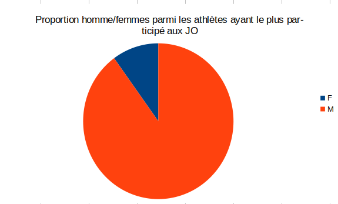

Également nous remarquons aussi qu'une bonne partie de ces athlètes sont de petite taille, si l'on effectue une moyenne arithmétique:

```
select avg(res.taille)
from (
  select a.taille from participe as p, athlete as a 
  where p.ano = a.ano and a.taille is not null
  group by a.ano, a.nom order by count(*) desc limit 20
) as res;
```

nous obtenons ce résultat:

```
         avg          
----------------------
 168.1000000000000000
```

On peut ainsi en conclure plusieurs tendances par rapport à le requête principale et se questionner sur le sens de ces tendances, pure coïncidence où il y a-t-il une vraie raison...

**Exemple: les athlètes de petite taille**

La plupart des athlètes dans cette liste font de la Gymnastique et c'est courant que les athlètes soient de petite taille car cette discipline affecte l'hormone de la croissance (source: https://www.marieclaire.fr/,pourquoi-les-gymnastes-sont-petits,827386.asp) mais c'est également pour des raisons de performance, un athlète plus petit fera des meilleures performances dans cette discipline.

### Analyse statistique des JO d'été de 1984 (Los Angeles)

Désormais, nous devons choisir une saison et une année aux JO pour les quelques questions qui vont suivre, ici ça sera Été 1984 se déroulant à Los Angeles.

> Donc suivant la saison et l'année que nous avons choisi, nous serons amené à ajouter ces deux restrictions dans les requêtes SQL:
>
> ```sql
> where saison = 'Summer' and annee = '1984'
> ```

Nous allons premièrement remplir le tableau statistique suivant:

| Pays | Moyenne d'âge | Nb sportifs | Min âge | Max âge |
|------|---------------|-------------|---------|---------|
|  |  |  |  |  |

via la requête SQL suivante:

```sql
select 
    r.nom_pays,
    # La fonction SQL round permet d''arrondir la moyenne à 2 chiffres après la virgule
    round(avg(a.age), 2) as moy_age,
    count(*) as nb_athlete,
    min(a.age) as min_age,
    max(a.age) as max_age
from participe as p, region as r, athlete as a
where p.noc = r.noc and p.nom_equipe = r.nom_equipe and p.ano = a.ano and saison = 'Summer' and annee = '1984'
group by r.nom_pays;
```

Extrait du tableau statistique:

```
             nom_pays             | moy_age | nb_athlete | min_age | max_age 
----------------------------------+---------+------------+---------+---------
 Algeria                          |   23.61 |         33 |      14 |      33
 Andorra                          |   29.00 |          2 |      25 |      33
 Antigua                          |   22.00 |         27 |      17 |      28
 Argentina                        |   24.30 |        115 |      17 |      54
 Australia                        |   22.74 |        337 |      14 |      52
 Austria                          |   23.75 |        130 |      17 |      47
 Bahamas                          |   21.42 |         31 |      16 |      33
 Bahrain                          |   21.33 |         14 |      21 |      22
 Bangladesh                       |   21.00 |          2 |      21 |      21
 Barbados                         |   23.88 |         25 |      19 |      37
 Belgium                          |   22.99 |         86 |      12 |      39
 Belize                           |   22.38 |         13 |      18 |      29
 Benin                            |   24.00 |          3 |      21 |      28
```

On peut étudier les 10 pays ayant le plus grand nombre d'athlètes participant à cette édition

```sql
select 
    r.nom_pays,
    count(*) as nb_athlete
from participe as p, region as r
where p.noc = r.noc and p.nom_equipe = r.nom_equipe and saison = 'Summer' and annee = '1984'
group by r.nom_pays
order by count(*) desc
limit 10;
```

On peut représenter ça avec un diagramme en barre:

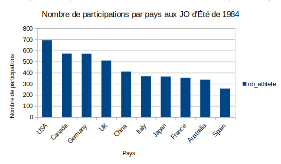

On peut déduire que ceux sont les nations les plus investis dans le sport, ayant ainsi le plus d'athlètes capables de participer à une édition des JO, on peut remarquer assez aisément suivant l'effectif que le mode de cette série statistique sont les USA, ce qui n'est pas surprenant, c'est l'une des nations ayant les plus grands athlètes des JO.

#### Comparaison d'âges...

Nous allons maintenant faire quelques comparaisons sur certaines caractéristiques des athlètes durant cette édition des JO...

En commençant par l'âge moyen des médaillés et l'âge moyen des participants (tout sexe confondu)

```sql
select round(avg(a.age), 2) as moy_age_medailles
from participe as p, athlete as a
where a.ano = p.ano and p.saison = 'Summer' and p.annee = '1984' and p.medaille is not null;
```

Sortie:

```
 moy_pour_medailles 
--------------------
              23.21
```

et l'âge des participants (médaillés + non médaillés)

```sql
select round(avg(a.age), 2) as moy_age_participants
from participe as p, athlete as a
where a.ano = p.ano and p.saison = 'Summer' and p.annee = '1984';
```

Sortie:

```
 moy_pour_medailles 
--------------------
              23.20
```

On remarque que l'âge moyen entre les médaillés et les participants est presque sensiblement le même, sans en prendre en considération les valeurs extrêmes (valeur aberrantes) la moyenne est un bon indicateur modal pour représenter la "tendance centrale" d'une série statistique. En l'occurrence, ici on peut en conclure qu'une bonne concentration des athlètes qui participent aux JO d'été de 1984 sont souvent médaillés vers les 23 ans.

#### Comparaison de poids...

Pour le poids, c'est presque la même requête que la précédente, à la différence près qu'on compare le poids (évidemment) et qu'on distingue les hommes et les femmes (par un groupement `GROUP BY`)

Pour les médaillés:

```
select a.sexe, round(avg(a.poids), 2) as moy_poids_medailles
from participe as p, athlete as a
where a.ano = p.ano and p.saison = 'Summer' and p.annee = '1984' and p.medaille is not null
group by a.sexe;
```

Sortie:

```
 sexe | moy_poids_medailles 
------+---------------------
 F    |               62.16
 M    |               78.89
```

Pour les participants (médaillés + non médaillés):

```sql
select a.sexe, round(avg(a.poids), 2) as moy_poids_participants
from participe as p, athlete as a
where a.ano = p.ano and p.saison = 'Summer' and p.annee = '1984'
group by a.sexe;
```

Sortie:

```
 sexe | moy_poids_participants 
------+------------------------
 F    |                  58.02
 M    |                  74.41
```

Nous pouvons remarquer une légère différence de la moyenne de poids entre les médaillés et les participants, on pourrait conclure que les médaillés ont plus tendance à être plus massifs (tout sexe confondu) mais la moyenne ne suffit pas pour conclure cette affirmation.

Il existe des cas exceptionnels (taille, poids, etc...) au cours de ces JO, ces valeurs extrêmes peuvent grandement influer sur la moyenne statistique, il faudrait donc plutôt se pencher vers la médiane qui gère mieux les valeurs extrêmes.

Pour cela, il faut lister et trier dans l'ordre croissant le poids pour un sexe donné, ex: pour le sexe masculin.

> On vérifie que le poids n'est pas nul car certains athlètes n'ont pas de poids renseigné dans la base...

```sql
select a.poids
from participe as p, athlete as a
where a.ano = p.ano and p.saison = 'Summer' and p.annee = '1984' and a.sexe = 'M' and a.poids is not null
order by a.poids asc;
```

On compte le nombre de poids:

```sql
select count(*)
from participe as p, athlete as a
where a.ano = p.ano and p.saison = 'Summer' and p.annee = '1984' and a.sexe = 'M' and a.poids is not null;
```

Sortie:

```
 count 
-------
  6632
```

**Calcul de médiane**

> offset n: commence le résultat par le n+1ème ligne (ici pour 3315, il commence par 3316) limit n: limite le reste des lignes à n lignes

Cette requête permet de récupérer les 2 éléments centraux de la série statistique:

```sql
select a.poids
from participe as p, athlete as a
where a.ano = p.ano and p.saison = 'Summer' and p.annee = '1984' and a.sexe = 'M' and a.poids is not null
order by a.poids asc 
offset 3315 limit 2;
```

Sortie:

```
 poids 
-------
 73.00
 73.00
```

> Si n est pair alors Me = (n_i + n\_(i+1)) / 2

Donc, 6632 / 2 = 3316 (soit Me = (73 + 73) / 2 = 73.0)

Donc la tendance centrale ne se trouve plus autour de 73kg pour les hommes participant aux JO d'été de 1984, qui est assez proche de la moyenne calculée précédemment (`74.41kg`), donc on peut conclure avec plus de certitude l'affirmation précédente.

### La place des femmes dans les JO

Nous allons maintenant étudier quelques requêtes pour se faire une idée de la place des femmes dans les JO, pour commencer nous allons lister 15 pays ayant eu le plus de médailles cumulées entre 1992 et 2016 et sur lequel nous allons nous baser pour étudier la proportion de femmes suivant plusieurs cas de figures:

```sql
select r.nom_pays, count(*) as nb_participations_medaille
from participe as p, region as r
where p.noc = r.noc and p.nom_equipe = r.nom_equipe and p.annee >= 1992 and p.annee <= 2016 and p.medaille is not null
group by r.nom_pays
order by count(*) desc
limit 15;
```

Sortie:

```
  nom_pays   | nb_participations_medaille 
-------------+-------
 USA         |  2181
 Russia      |  1427
 Germany     |  1268
 Australia   |   889
 China       |   867
 Canada      |   742
 Italy       |   602
 France      |   582
 UK          |   564
 Netherlands |   519
 South Korea |   491
 Japan       |   481
 Norway      |   387
 Spain       |   386
 Sweden      |   364
```

Par rapport à un graphique précédent montrant le nombre de participations pour les 10 pays ayant le plus grand nombre de participations pour les JO d'Été de 1984, ici on remarque que quelques pays de cet ancien graphique refont surface dans ce graphique ci-dessus, notamment les États-Unis qui maintiennent leur suprématie.

Voici sa représentation en diagramme en bâton:

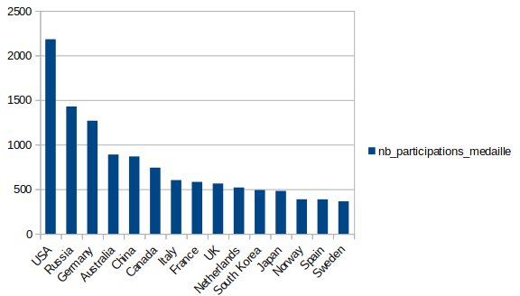{width=250, height=250}

### Représentation de l'évolution

Enfin, nous allons représenter une évolution sur 5 pays parmi les 15 précédents.

Parmi ces pays nous allons choisir 5 pays:

* Allemagne (GER)
* France (FRA)
* Suède (SWE)
* Japon (JPN)
* Espagne (ESP)

et représenter leur évolution... Nous allons représenter leur évolution pour chaque question avec 2 graphiques, un pour les JO d'Hiver et l'autre pour les JO d'Été.

> Pour cela on ajoute les restrictions suivantes sur toutes les requêtes SQL:
>
> ```sql
> p.annee >= 1992 and p.annee <= 2016 and p.noc = 'NOC' and p.saison = 'Season'
> ```
>
> *NOC : National Olympic Committee, c'est le code représentant le pays (FRA pour France par exemple)*

**Nombre de participants:**

```sql
select p.annee, count(distinct p.ano)
from participe as p
where p.annee >= 1992 and p.annee <= 2016 and p.noc = 'NOC' and p.saison = 'Season'
group by p.annee;
```

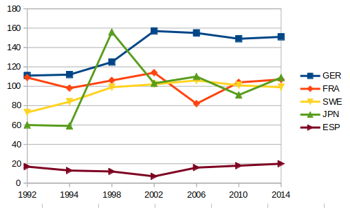

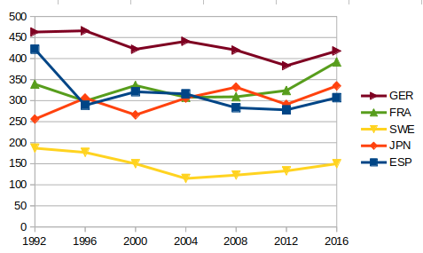

Tout d'abord, on observe que l'Allemagne est le pays le plus représenté dans les deux types de Jeux. Cela peut être attribué à plusieurs facteurs, notamment la tradition sportive et la volonté d'investir dans les disciplines olympiques. Ensuite, la France se positionne également parmi les pays avec une forte participation, ce qui peut être attribué à son héritage sportif. On peut également noter que la participation de l'Espagne est relativement faible dans les deux types de Jeux, ce qui peut être dû à des raisons telles que la moindre popularité des sports d'hiver dans le pays contrairement à la Suède qui est un pays nordique, le nombre de participants d'hiver sera donc plus conséquent.

---

**Nombre de médaillés:**

```sql
select p.annee, count(distinct p.ano)
from participe as p
where p.annee >= 1992 and p.annee <= 2016 and p.noc = 'NOC' and p.saison = 'Season' and p.medaille is not null
group by p.annee;
```

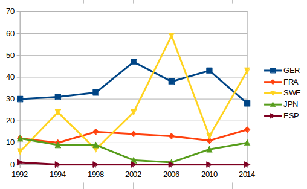

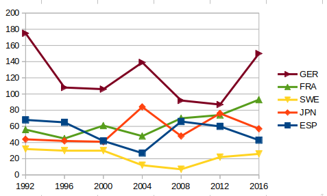

On observe que l'Allemagne (GER) se distingue comme le pays avec le plus grand nombre de médailles dans les deux types de Jeux. Ce qui est logique puisque il y a une domination du nombre de participants. La France (FRA) est également un acteur solide avec un nombre de médailles significatif dans les deux catégories. La Suède (SWE) a également obtenu un nombre notable de médailles, en particulier aux Jeux Olympiques d'hiver. En revanche, le Japon (JPN) et l'Espagne (ESP) ont un nombre de médailles relativement plus faible. Ces variations peuvent être liées à des facteurs tels que les politiques de soutien au sport, les traditions sportives et les ressources allouées au développement des athlètes.

---

**Nombre de femmes participantes:**

```sql
select p.annee, count(distinct p.ano)
from participe as p, athlete as a
where a.ano = p.ano and a.sexe = 'F' and p.annee >= 1992 and p.annee <= 2016 and p.noc = 'NOC' and p.saison = 'Season'
group by p.annee;
```

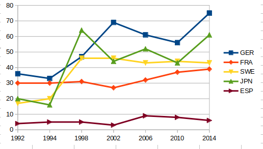

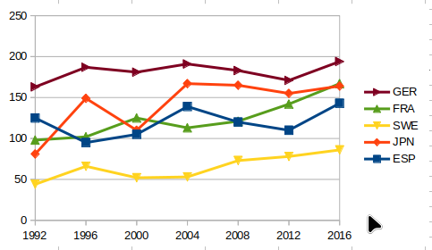

On remarque une domination du nombre de participantes allemandes. Les Allemandes sont toujours les plus nombreuses aussi bien en hiver qu'en été. On voit une forte augmentation du nombre de femmes suédoises en 1998 aux JO de Nagano.

Concernant les Jeux Olympiques d'hiver, l'Allemagne (GER) a généralement le plus grand nombre de femmes participantes, suivi par la Suède (SWE) et la France (FRA).

Pour les Jeux Olympiques d'été, les mêmes pays, à savoir l'Allemagne (GER), la France (FRA) et la Suède (SWE), présentent également un nombre élevé de femmes participantes. Toutefois, il convient de noter que le Japon (JPN) et l'Espagne (ESP) augmentent leur participation féminine au fil des années.

---

**Proportion de femmes participantes:**

> La proportion de femmes participantes est caclulé dynamiquement sur le tableur.

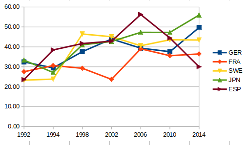

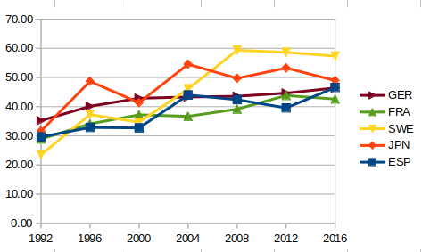

Pour les Jeux Olympiques d'hiver, on constate une augmentation progressive de la proportion de femmes participantes au fil des années dans la plupart des pays. L'Espagne (ESP) présente une proportion relativement élevée de femmes participantes dès le départ, tandis que les autres pays affichent des pourcentages plus modestes mais en augmentation régulière.

Pour les Jeux Olympiques d'été, les proportions de femmes participantes sont globalement plus élevées que celles des Jeux d'hiver. Les pays tels que l'Allemagne (GER), la France (FRA) et la Suède (SWE) montrent des proportions de femmes participantes plus élevées et stables tout au long de la période étudiée.

---

**Proportion des médaillées parmi les femmes:**

```sql
select p.annee, count(distinct p.ano)
from participe as p, athlete as a
where a.ano = p.ano and a.sexe = 'F' and p.annee >= 1992 and p.annee <= 2016 and p.noc = 'NOC' and p.saison = 'Season' and p.medaille is not null
group by p.annee;
```

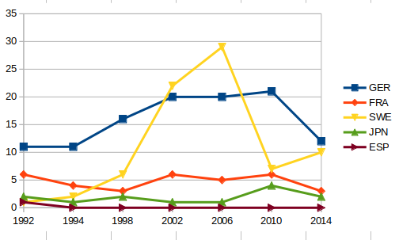

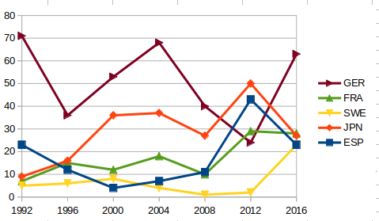

Pour les Jeux Olympiques d'hiver, la proportion de médaillées parmi les femmes est relativement faible pour la plupart des pays. La Suède (SWE) présente les proportions les plus élevées de médaillées parmi les femmes, tandis que les autres pays affichent des pourcentages plus faibles.

Pour les Jeux Olympiques d'été, on observe une plus grande variation dans les proportions de médaillées parmi les femmes. L'Allemagne (GER) et la Suède (SWE) présentent des pourcentages plus élevés de médaillées parmi les femmes, tandis que la France (FRA) montre également des performances solides. D'autre part, le Japon (JPN) et l'Espagne (ESP) ont des proportions plus faibles de médaillées parmi les femmes.

---

**Proportion de femmes parmi les médaillés:**

> La proportion de femmes parmi les médaillés est calculé dynamiquement sur le tableur.

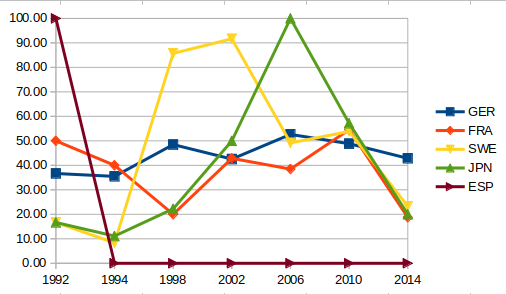

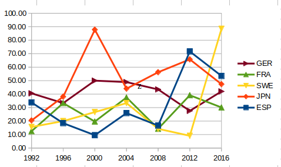

Pour les Jeux Olympiques d'hiver, la proportion de femmes parmi les médaillés varie d'une année à l'autre et d'un pays à l'autre. En général, les pays présentent des pourcentages assez élevés de femmes parmi les médaillés, ce qui suggère une représentation relativement équilibrée entre les genres lors de l'obtention de médailles. Cependant, il convient de noter que l'Espagne (ESP) n'a pas obtenu de médailles lors des Jeux d'hiver étudiés.

Pour les Jeux Olympiques d'été, on observe également une variation dans la proportion de femmes parmi les médaillés. Certains pays affichent des pourcentages élevés de femmes parmi les médaillés, notamment l'Allemagne (GER) et le Japon (JPN), tandis que d'autres pays montrent des proportions plus modestes. La Suède (SWE) présente des pourcentages relativement élevés pour certaines années, tandis que la France (FRA) a également une représentation équilibrée entre les genres parmi les médaillés.